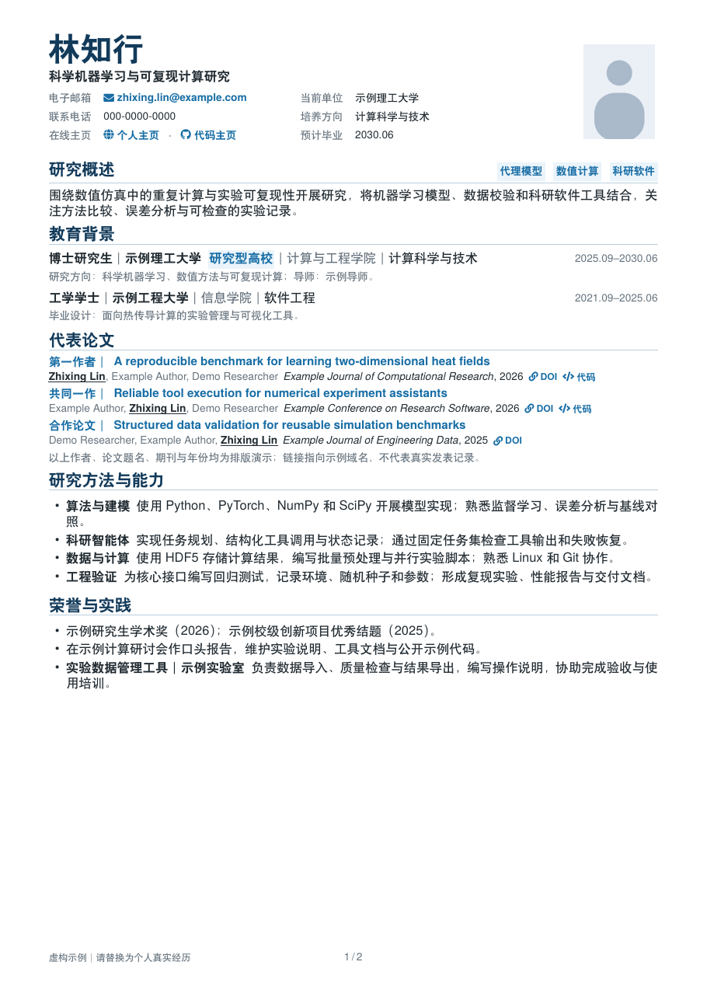
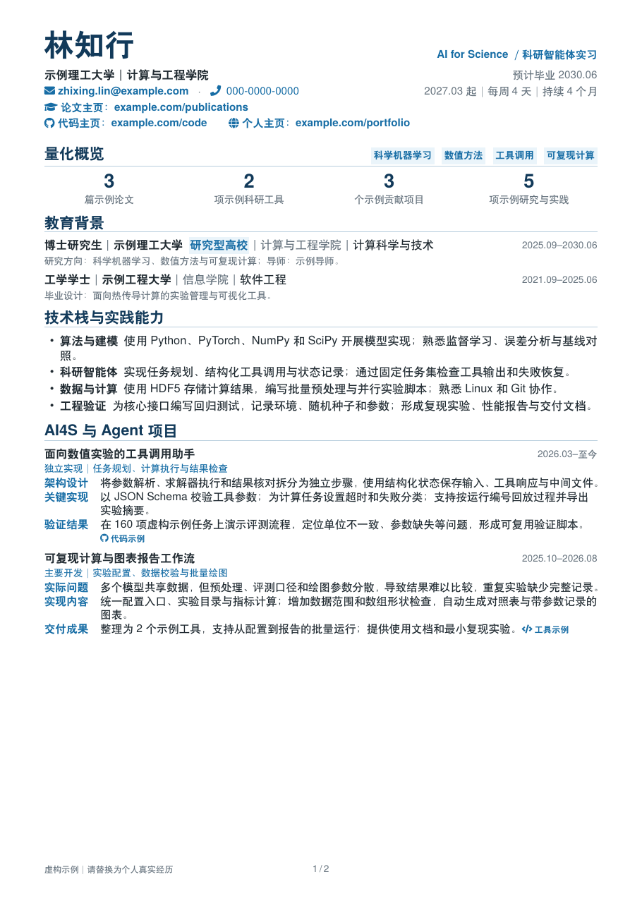
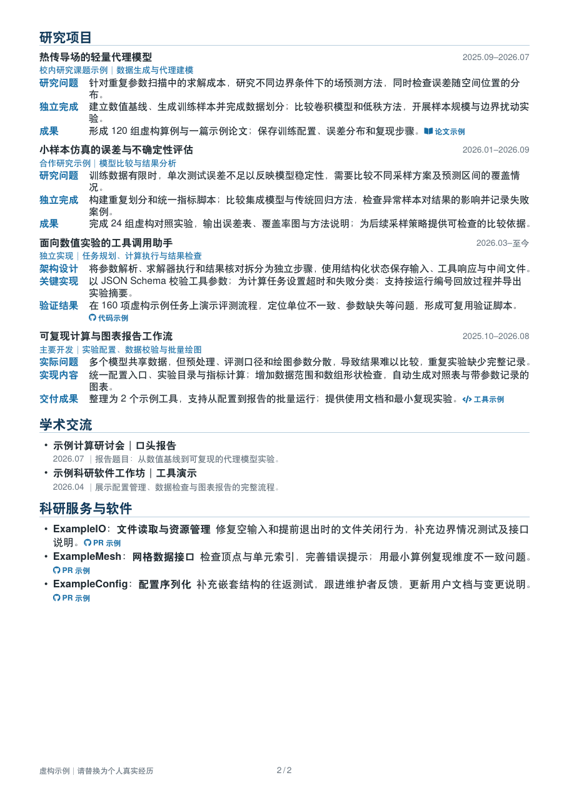
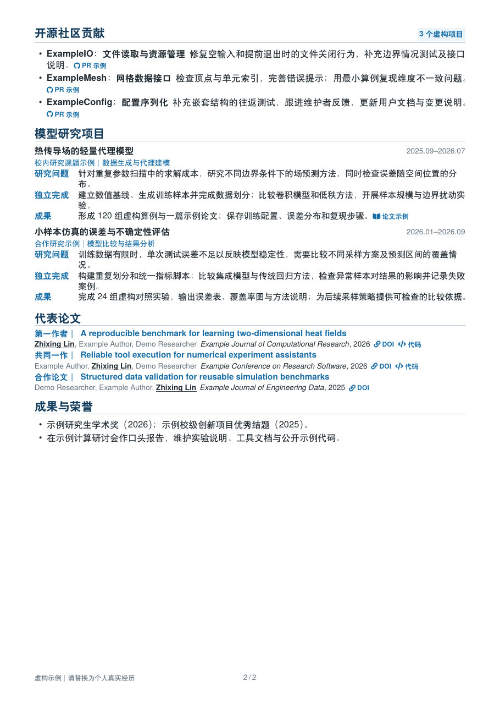
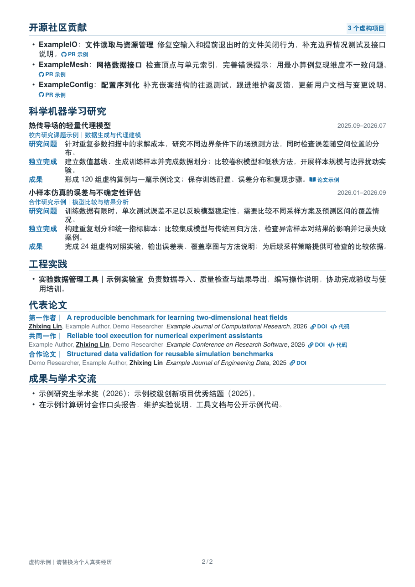

# Research CV｜科研与技术求职简历模板

面向研究生、博士与技术研发人员的中文 LaTeX 简历模板，提供**学术、企业研发、AI for Science** 三套两页示例。共用个人信息、论文记录与排版组件，按申请场景调整模块重点。

所有姓名、学校、经历、成果数字和论文记录均为虚构示例；照片是几何占位图，示例链接统一使用 `example.com`。它们用于展示排版，不代表作者履历。

## 三版预览

| 学术版 | 企业研发版 | AI4S 版 |
| --- | --- | --- |
| [完整 PDF](medium-professional-research-cn.pdf) | [完整 PDF](medium-professional-industry-cn.pdf) | [完整 PDF](medium-professional-ai4s-cn.pdf) |
| [](medium-professional-research-cn.pdf) | [](medium-professional-industry-cn.pdf) | [](medium-professional-ai4s-cn.pdf) |
| [](medium-professional-research-cn.pdf) | [](medium-professional-industry-cn.pdf) | [](medium-professional-ai4s-cn.pdf) |

## 选择适合的版本

| 版本 | 适用场景 | 组织重点 |
| --- | --- | --- |
| 学术版 | 博士、博后、联培及科研申请 | 研究概述、教育、论文、方法能力、研究项目与学术交流 |
| 企业研发版 | 算法、AI、仿真及研发岗位 | 量化概览、技术栈、工程项目、工程实践与可检查的成果 |
| AI4S 版 | 科学机器学习、科研智能体与研究实习 | 无照片页眉、研究方向与实习安排、算法项目、科研软件和模型研究 |

三版复用蓝灰配色、10.8 pt 正文、13.5 pt 基础行距、可点击的成果链接及防拆页条目。页眉可带照片，也可采用无照片的信息行；模块标题支持右侧关键词。

## 下载与编译

在 [Releases](https://github.com/guhou-hvi/research-cv/releases) 获取 PDF 和对应版本源码，或点击 **Code → Download ZIP** 下载当前源码。也可以通过 **Use this template** 创建自己的仓库。

只读预览无需安装软件。编辑后编译需要 **XeLaTeX**，请在模板根目录执行：

```text
xelatex -interaction=nonstopmode -halt-on-error medium-professional-research-cn.tex
xelatex -interaction=nonstopmode -halt-on-error medium-professional-research-cn.tex
```

企业版和 AI4S 版分别将文件名替换为 `medium-professional-industry-cn.tex`、`medium-professional-ai4s-cn.tex`。两遍编译用于更新页码与交叉引用。

如果已安装 Python 3，可一次编译三版，结果输出到 `build/`：

```text
python scripts/build.py
```

### 环境与依赖

- 已验证 Windows MiKTeX 和 Ubuntu 24.04／TeX Live 2023，三套示例均为两页，见 [验证记录](docs/validation.md)。
- 默认使用 TeX 发行版提供的 **TeX Gyre Heros／Cursor 和 Fandol** 字体，不依赖 Windows 字体目录。
- 主要宏包：`fontspec`、`xeCJK`、`geometry`、`array`、`enumitem`、`ifthen`、`xcolor`、`ulem`、`hyperref`、`tabularx`、`fancyhdr`、`graphicx`、`needspace`、`lastpage`。
- `fontawesome5` 为可选依赖：存在时显示图标，未安装时使用紧凑文字标识。无需安装系统 Academicons 字体。
- 生成 PNG 需要完整的 Poppler（包含 CJK 字符映射）；发布检查还需要 Python 包 `pypdf`。
- Overleaf 尚未单独验证，因此不承诺直接导入即可得到相同结果。

Ubuntu 的已验证最小安装组合：

```sh
sudo apt-get update
sudo apt-get install --yes --no-install-recommends texlive-xetex texlive-lang-chinese texlive-fonts-recommended texlive-plain-generic tex-gyre fonts-texgyre poppler-utils poppler-data python3-pypdf
```

MiKTeX 可按提示安装缺失宏包。字体包为 `tex-gyre`、`fandol`，CJK 映射数据使用 `adobemapping`。不要把个人电脑里的商业字体上传到仓库。

## 替换内容

| 文件 | 修改内容 |
| --- | --- |
| `profile-data.tex` | 姓名、联系方式、学校、教育经历、毕业时间、可选学校标签、页眉链接与量化数字 |
| `publications-data.tex` | 作者顺序、论文题目、期刊、年份、论文和代码链接 |
| `example-content.tex` | 技能、项目、贡献、实践、荣誉与示例成果 |
| 三个入口 `.tex` | 求职方向、模块顺序、强制分页与版本专属设置 |
| `assets/id-photo.jpg` | 几何占位头像；可换为自己的图片，并更新 `\PortraitAsset` 路径 |

显示文字和链接目标要一起替换。包含下划线的邮箱在显示文字中写成 `name\_demo@example.com`，在 `mailto:` 目标中保留原始下划线。

学校标签是可选字段，可删除教育行中的 `\cveducationbadge{\SchoolBadge}`。所有论文和 PR 示例链接都是占位地址，**不是实际 DOI 或合并记录**。

准备实际投递时，删除或重写 `\FictionNotice` 对应的示例页脚，并核实全部成果。填写真实资料后，请自行决定仓库可见性；仅删除当前文件不会清除历史提交中的内容。

## 调整布局

- `resume.cls`：颜色、字号、页眉、章节和基础条目。
- `cv-layout.tex`：教育字段分隔、条目间距、结构化项目和招聘版论文布局。
- `cv-fonts.tex`：跨平台默认字体。需要个性化字体时，将 `cv-fonts.local.example.tex` 复制为 `cv-fonts.local.tex` 后修改；后者默认不纳入 Git。
- `\researchcase`：以“研究问题／独立完成／成果”组织项目，可在局部分组内改为“架构设计／关键实现／验证结果”等标签。
- `\newpage`：控制示例的第二页起点。内容增加后优先精简重复信息，再调整模块；模板不会自动把任意长度的履历压成两页。

示例中的完整教育、项目和论文条目尽量避免跨页；超出一整页高度的单个条目仍需拆分或缩短。

## 更新 PDF 与检查

在安装了 Poppler 和 `pypdf` 的开发环境中：

```text
python scripts/build.py --refresh-previews
python scripts/check_release.py
```

第一条命令更新三份公开 PDF 和六张预览图；第二条检查公开文件白名单、两页要求、虚构示例页脚、外部链接及 PDF 元数据。中文提取使用 Poppler，避免部分 PDF 库对 Adobe CJK 编码支持不完整。

GitHub Actions 会在 Linux 上重新编译并检查示例。程序检查之外，发布前仍需查看六页预览，检查换行、照片、孤立标题和内容含义。

## 常见问题

**为什么仍保留旧文件名？**

本项目由 `academic-style` 升级并更名，原研究版和行业版入口名称继续可用。共享文件结构已有调整；迁移旧的个人修改时，可参考 [更新说明](CHANGELOG.md)。

**出现中文缺字或 PDF 预览乱码怎么办？**

先确认 Fandol 字体已安装，并检查编译日志中的 `Missing character`。如果 PDF 在正常阅读器中显示正确，但命令行转换图像或文本失败，应检查 Poppler 的 CJK 映射数据；不要直接发布缺字截图。

**可以用 AI 辅助修改吗？**

可以。明确要改的版本、模块和篇幅，修改后重新编译、查看 PDF，并核实事实与链接。若使用外部工具处理真实履历，请先考虑哪些信息适合提供。

## 许可与来源

本项目由 [guhou-hvi](https://github.com/guhou-hvi) 维护，采用 **CC BY-NC-SA 4.0**：署名、非商业性使用、相同方式共享。具体条款见 [LICENSE](LICENSE) 和 [官方许可文本](https://creativecommons.org/licenses/by-nc-sa/4.0/legalcode)。

基于 LaTeXTemplates.com 的 *Medium Length Professional CV LaTeX Template*（Version 3.0）修改；保留 Vel 与 Trey Hunner 的上游署名。字体和可选宏包由各自发行版提供，适用其各自许可。
